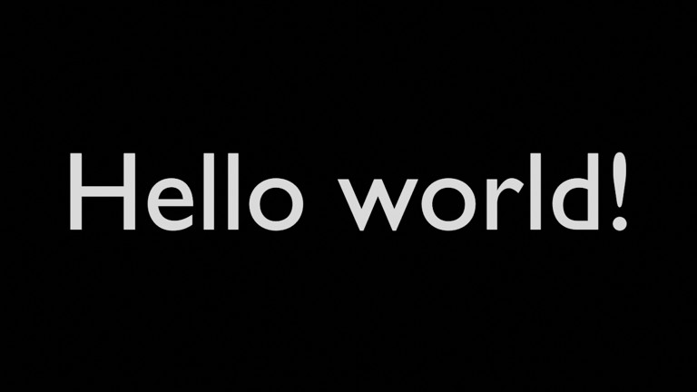

# Hello world!

Minimal baseline: white Hello world! text centered on a black background.

- source commit: `6919fd4f511ea5099bef1d79576e7a84c820b654`
- Actions run: `2` (`36217773152`)
- full artifact: `blender-hello-telop`

## Blend files

- Git: [scene.blend](./scene.blend) (850,032 bytes)



## Validation

```json
{
  "path": "/home/runner/work/tmp-blender-telop/tmp-blender-telop/output/render.png",
  "size_bytes": 377978,
  "width": 1280,
  "height": 720,
  "luminance_stddev": 46.624,
  "hello_bright_pixels": 30897,
  "unique_colors_64x36": 142,
  "sha256": "fa38aba858853ffd07a72e45969a6da245174f29ba01e6d822a2def72e7c85e6"
}
```
